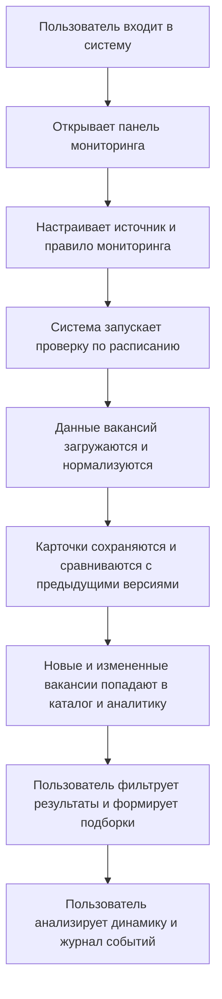

## 1. Обзор продукта
Информационная система предназначена для автоматического мониторинга вакансий по разным специальностям, объединения объявлений из нескольких источников и оперативного отслеживания изменений по заданным правилам.
- Продукт помогает специалистам, карьерным консультантам, рекрутерам и аналитикам быстро находить новые вакансии, отслеживать рыночную динамику и собирать релевантные подборки.
- Основная ценность системы состоит в сокращении времени на ручной поиск, в централизованном хранении результатов и в прозрачной аналитике по специальностям, компаниям и регионам.

## 2. Ключевые функции

### 2.1 Роли пользователей
| Роль | Способ доступа | Основные права |
|------|----------------|----------------|
| Оператор системы | Вход по логину и паролю | Управление источниками, фильтрами, мониторингом и аналитикой |
| Аналитик | Вход по логину и паролю | Просмотр вакансий, подборок, статистики и истории изменений |

### 2.2 Функциональные модули
1. **Панель мониторинга**: сводка по активности источников, новым вакансиям, изменениям зарплат и статусов.
2. **Каталог вакансий**: общий список объявлений с поиском, фильтрацией, сортировкой и просмотром карточки.
3. **Правила мониторинга**: управление специальностями, ключевыми словами, регионами, графиками проверки и условиями отбора.
4. **Источники данных**: реестр сайтов и страниц мониторинга, состояние последнего обхода, лимиты и ошибки.
5. **Подборки и избранное**: сохраненные наборы вакансий, метки, заметки, экспорт и повторное использование фильтров.
6. **Аналитика**: статистика по динамике вакансий, компаниям, городам, специализациям и уровню оплаты.
7. **Журнал событий**: история запусков мониторинга, изменений по вакансиям, ошибок обработки и действий пользователей.

### 2.3 Детализация страниц
| Название страницы | Модуль | Описание функции |
|-------------------|--------|------------------|
| Панель мониторинга | Сводные карточки | Показывает число новых вакансий, активных правил, источников с ошибками и последних запусков |
| Панель мониторинга | Лента активности | Отображает последние найденные вакансии, изменения зарплат и закрытия объявлений |
| Каталог вакансий | Таблица вакансий | Выводит унифицированный список вакансий с фильтрами по специальности, региону, зарплате и источнику |
| Каталог вакансий | Карточка вакансии | Показывает описание, требования, дату публикации, историю изменений и статус отслеживания |
| Правила мониторинга | Конструктор правил | Позволяет задавать ключевые слова, исключения, регионы, интервалы проверки и пороги оповещения |
| Правила мониторинга | Шаблоны фильтров | Сохраняет типовые наборы параметров для различных специальностей |
| Источники данных | Реестр источников | Содержит адрес, тип источника, частоту обхода, статус и дату последнего обновления |
| Источники данных | Диагностика | Показывает ошибки парсинга, задержки ответа и пропущенные обновления |
| Подборки | Сохраненные выборки | Формирует рабочие списки вакансий для дальнейшего анализа и экспорта |
| Аналитика | Графики и распределения | Визуализирует динамику вакансий по времени, специализациям, городам и компаниям |
| Журнал событий | История операций | Фиксирует технические события системы и действия пользователей |

## 3. Основной процесс
Пользователь настраивает источники и правила мониторинга, после чего система по расписанию получает данные, нормализует карточки вакансий, обновляет базу, выявляет изменения и отображает результат в едином интерфейсе. Далее оператор анализирует подборки, уточняет фильтры и использует статистику для принятия решений.

## 4. Дизайн интерфейса
### 4.1 Стиль
- Основная палитра: графитовый, теплый белый, темный синий, латунный акцент.
- Стиль кнопок: плоские, плотные по вертикали, со строгим контуром и выразительным hover-состоянием.
- Типографика: акцентный гротеск для заголовков и нейтральная антиква или humanist sans для данных и таблиц.
- Компоновка: desktop-first, асимметричная сетка, сочетание аналитических панелей и длинных табличных блоков.
- Иконографика: строгие линейные пиктограммы без декоративной мультяшности.

### 4.2 Обзор страниц
| Название страницы | Модуль | UI-элементы |
|-------------------|--------|-------------|
| Панель мониторинга | Верхняя сводка | Контрастные KPI-блоки, короткие подписи, локальные индикаторы статуса |
| Панель мониторинга | Лента активности | Компактные строки с временными метками, цветовой маркировкой и быстрыми действиями |
| Каталог вакансий | Фильтры | Панель фильтров с чекбоксами, диапазонами, поиском и сохранением шаблонов |
| Каталог вакансий | Таблица | Плотная таблица с закрепленным заголовком, цветными статусами и развертыванием строк |
| Правила мониторинга | Формы | Модульные формы с явным разделением базовых и расширенных параметров |
| Источники данных | Карточки источников | Лаконичные карточки с техническими метками, пульсом состояния и историей запусков |
| Аналитика | Графики | Темный фон, светлые оси, тонкие акцентные линии и минимальный визуальный шум |

### 4.3 Адаптивность
Интерфейс проектируется по принципу desktop-first. На планшетах таблицы переходят в карточный режим, боковые панели сворачиваются. На мобильных устройствах сохраняются ключевые сценарии просмотра, поиска и фильтрации с приоритетом читабельности.
