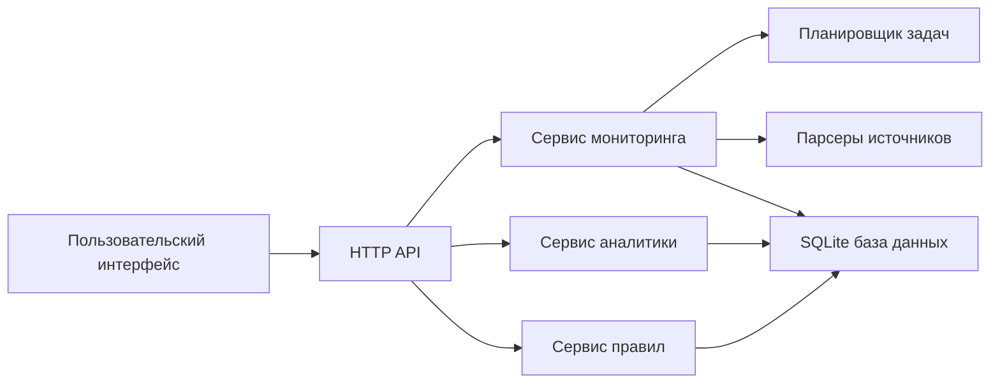
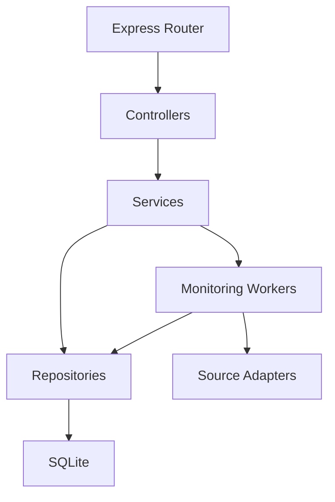
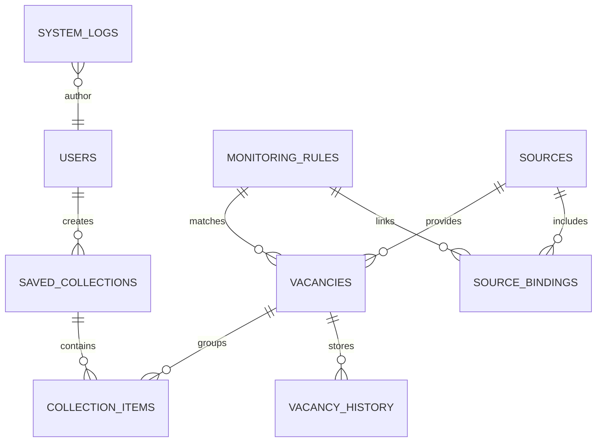

## 1. Архитектурное решение
Система строится как full-stack приложение с серверным API, локальной реляционной базой данных и frontend-частью на ванильном TypeScript без клиентского фреймворка. Такой стек дает предсказуемое поведение, простую поддержку и низкий порог разворачивания.



## 2. Технологии
- Frontend: Vite + TypeScript + HTML + CSS + Chart.js.
- Backend: Node.js LTS + Express + TypeScript.
- База данных: SQLite.
- Планировщик фоновых задач: `node-cron`.
- HTTP-запросы и загрузка страниц: `axios`.
- Работа с HTML-структурой источников: `cheerio`.
- Валидация данных: `zod`.
- Хранение конфигурации: `.env` + серверные настройки.
- Тестирование: Vitest для модулей и Supertest для API.

## 3. Маршруты интерфейса
| Маршрут | Назначение |
|---------|------------|
| / | Панель мониторинга и оперативная сводка |
| /vacancies | Каталог вакансий с фильтрами и поиском |
| /rules | Настройка правил мониторинга |
| /sources | Управление источниками данных |
| /analytics | Аналитика и статистические срезы |
| /logs | Журнал событий и ошибок |

## 4. API
### 4.1 Основные конечные точки
| Метод | Маршрут | Назначение |
|-------|---------|------------|
| GET | /api/dashboard | Получение сводных показателей и последних событий |
| GET | /api/vacancies | Получение списка вакансий по фильтрам |
| GET | /api/vacancies/:id | Получение детальной карточки вакансии |
| POST | /api/rules | Создание правила мониторинга |
| PUT | /api/rules/:id | Обновление правила мониторинга |
| GET | /api/rules | Получение списка правил |
| GET | /api/sources | Получение списка источников |
| POST | /api/sources | Добавление источника |
| POST | /api/monitoring/run | Ручной запуск мониторинга |
| GET | /api/analytics/summary | Получение агрегированной статистики |
| GET | /api/logs | Получение журнала событий |

### 4.2 Типы данных
```ts
export interface VacancyRecord {
  id: number
  title: string
  company: string
  location: string
  specialty: string
  salaryText: string | null
  salaryMin: number | null
  salaryMax: number | null
  employmentType: string | null
  sourceName: string
  sourceUrl: string
  publishedAt: string | null
  firstSeenAt: string
  lastSeenAt: string
  status: "new" | "updated" | "unchanged" | "archived"
}

export interface MonitoringRule {
  id: number
  name: string
  specialty: string
  keywords: string[]
  exclusions: string[]
  regions: string[]
  scheduleCron: string
  isActive: boolean
}
```

## 5. Серверная схема


## 6. Модель данных
### 6.1 ER-диаграмма


### 6.2 Таблицы
- `users`: учетные записи и роли.
- `sources`: источники данных, параметры доступа, статус обхода.
- `monitoring_rules`: правила отбора по специальностям, ключевым словам и регионам.
- `source_bindings`: связи правил и источников.
- `vacancies`: нормализованные карточки вакансий.
- `vacancy_history`: история изменений заголовка, зарплаты, статуса и описания.
- `saved_collections`: пользовательские подборки.
- `collection_items`: состав подборок.
- `system_logs`: технические и пользовательские события.

### 6.3 DDL-ориентиры
- Индексы по `vacancies.specialty`, `vacancies.location`, `vacancies.status`, `vacancies.lastSeenAt`.
- Уникальный ключ по сочетанию `sourceId + externalId`.
- Индексы по `monitoring_rules.isActive` и `sources.isActive` для фоновых задач.
- Таблица `vacancy_history` хранит срезы только при фактическом изменении значимых полей.

## 7. Нефункциональные требования
- Приоритет на стабильность и простое локальное развертывание без внешних облачных зависимостей.
- Отказоустойчивое поведение парсеров: ошибки отдельных источников не останавливают общий цикл.
- Явное логирование каждого запуска мониторинга и каждого сбоя.
- Разделение слоев UI, API, сервисов и доступа к данным для дальнейшего расширения.
- Возможность добавить новые адаптеры источников без переработки основной архитектуры.
